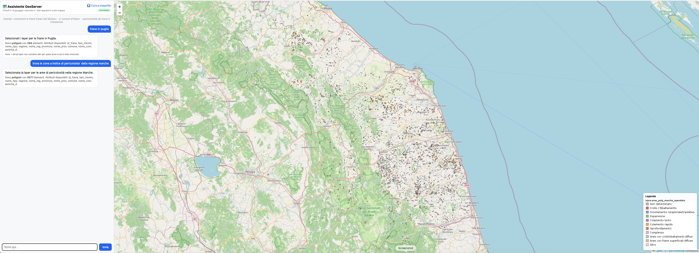

# mcp-geo-server

An **intelligent MCP (Model Context Protocol) server** that drives a **GeoServer**
instance in natural language, plus a **chat + map web UI** and a fully
**Dockerised, domain-agnostic** GIS stack.

The MCP server is built with the **Microsoft Agent Framework**: an LLM-backed
*agent* is given the GeoServer operations as tools and exposed as a single MCP
tool via `agent.as_mcp_server()`. Any MCP client sends a request like *"how many
features in topp:states?"* and the agent decides which GeoServer operations to
call. The LLM backend is pluggable — **host Ollama**, **Ollama Cloud**, or
**Anthropic Claude**.

Nothing in the code is tied to a specific dataset: the example stack ships the
ISPRA landslide/hazard open data, but the catalog, the natural-language layer
resolution and the thematic styles are all **driven by GeoServer metadata and
config**, so the same stack serves any domain.

The same async core (`GeoServerClient` + the `geo_*` tool functions + the shared
`ingest`/`catalog`/`styling` modules) is used by the agent, the web UI and the
data bootstrap — there is exactly one place that talks to GeoServer.



*The chat (left) resolves a natural-language request to GeoServer layers and
renders them on the map (right) with a thematic legend — here the landslide
areas of the Marche region, classified by movement type.*

---

## Highlights

- 🧠 **Natural-language GeoServer agent** over MCP (stdio or streamable-HTTP).
- 💬 **Chat-first web UI**: ask in plain language, the matching layers render on a
  Leaflet map with a live WMS legend. Shapefile upload on a dedicated page.
- 📦 **Idempotent data bootstrap**: drop shapefiles in `./data`, the stack loads
  them into PostGIS and publishes them as GeoServer layers automatically.
- 🎨 **Config-driven thematic SLD styles** (YAML) — no styles hardcoded in code.
- 🌍 **Domain-agnostic**: the layer catalog is read from the WMS capabilities;
  style assignment is name-pattern based. Point it at any GeoServer.
- 🖥️ **Native arm64 + amd64** images (no QEMU emulation on Apple Silicon), with a
  per-architecture image switch in the Makefile.
- 🚀 **CI/CD**: a GitHub Action builds and publishes multi-arch images to GHCR.

## Prerequisites

- Python **3.11+**
- Docker + Docker Compose
- A **host Ollama** (https://ollama.com) for the local LLM — or use Ollama Cloud
  / Anthropic instead. There is **no Ollama container**; the stack talks to the
  host Ollama via `host.docker.internal`.

## 1. Start the stack (Docker)

```bash
ollama serve &            # start host Ollama (if not already running)
make ollama-pull          # pull the model onto the HOST Ollama (see OLLAMA_LLM_MODEL)
make build                # build the app images + pull GeoServer/PostGIS (per host arch)
make up                   # start the whole stack (checks host Ollama is reachable)
```

The Compose project is `mcp-geo-server`:

| Service | Container | Endpoint / role |
|---|---|---|
| `webui` | `mcp-geo-server-webui` | <http://localhost:8000> — chat + map UI (also proxies WMS) |
| `mcp` | `mcp-geo-server-mcp` | <http://localhost:9000/mcp> — intelligent MCP server (streamable-HTTP) |
| `geoserver` | `mcp-geo-server-geoserver` | <http://localhost:8080/geoserver> (admin / `geoserver`) |
| `postgis` | `mcp-geo-server-postgis` | `localhost:5432` (gis / gis / gis) |
| `geo-init` | `mcp-geo-server-init` | one-shot: load `./data` shapefiles + apply styles, then exits |

The LLM (host Ollama / Cloud / Anthropic) is reached lazily over the network, so
it never gates startup. GeoServer runs with `CORS_ENABLED=true`; the web UI also
proxies WMS (see below) so the browser never needs to reach GeoServer directly.

### Native images & the per-architecture switch

Base images are multi-arch and selected by `uname -m` in the Makefile, so they
run **native** (no emulation) on both Apple Silicon and Intel:

| Host arch | PostGIS | GeoServer | GeoServer data dir |
|---|---|---|---|
| `arm64` / `aarch64` | `imresamu/postgis:16-3.4` | `kartoza/geoserver:2.28.0` | `/opt/geoserver/data_dir` |
| `amd64` | `postgis/postgis:16-3.4` | `docker.osgeo.org/geoserver:2.28.0` | `/opt/geoserver_data` |

Override per run with `POSTGIS_IMAGE` / `GEOSERVER_IMAGE` / `GEOSERVER_DATA_DIR`.
Bare `docker compose` (without `make`) defaults to the multi-arch images.

## 2. Web UI — chat & map

Open <http://localhost:8000>. The window is split: **left = chat**, **right = a
Leaflet/OpenStreetMap map** with a WMS legend (bottom-right).

- **Chat** — type a request like *"mostrami le frane lineari del Molise"* or
  *"trova le frane in Puglia"*. An LLM resolves it to the matching published
  layer(s) (`POST /api/ask`); the map renders them as WMS overlays, zooms to
  their extent, shows the legend, and the assistant replies with a **textual
  description of the data type** (geometry kind, feature count, attributes).
  Empty layers are flagged and not drawn.
- **⬆️ Carica shapefile** (dedicated page `/upload`) — drag-and-drop a `.zip`
  shapefile; it is loaded into PostGIS (`uploads` workspace) and published
  (`POST /api/upload`).

### WMS proxy

The UI talks to WMS **only through the web UI** (`GET /wms`), which forwards
GetMap/GetLegendGraphic to GeoServer over the internal network and streams the
bytes back. This keeps everything same-origin (no host/port juggling, no CORS),
and retries on transient `429` so tiled overlays load reliably.

## 3. Data bootstrap & thematic styles

**Bootstrap** — the `geo-init` container loads **every** shapefile under `./data`
into PostGIS and publishes each as a GeoServer layer (default workspace `ispra`,
datastore `ispra_pg`), reprojecting to EPSG:4326. Fully idempotent and
transversal — no assumption about folder names; the layer name comes from the
parent folder. It runs automatically on `make up`; re-run on demand:

```bash
make init          # load any new shapefiles + (re)apply styles
make init-force    # drop & reload tables that already exist
make styles        # only (re)apply the thematic styles
make init-logs     # tail the geo-init logs
```

| Variable | Default | Meaning |
|---|---|---|
| `GEO_INIT_ENABLE` | `true` | Turn the bootstrap on/off |
| `GEO_INIT_WORKSPACE` / `GEO_INIT_DATASTORE` | `ispra` / `ispra_pg` | Target workspace / PostGIS datastore |
| `GEO_INIT_TARGET_SRS` | `EPSG:4326` | All layers reprojected to this SRS |
| `GEO_INIT_SOURCE_SRS` | _(none)_ | Fallback source SRS for shapefiles without a `.prj` |
| `GEO_INIT_SHAPE_ENCODING` | `ISO-8859-1` | Shapefile attribute encoding (e.g. ISPRA `.cst`) |
| `GEO_INIT_FORCE` | `false` | Drop & reload existing tables |
| `GEO_INIT_STYLES` | `true` | Apply the thematic styles after publishing |
| `GEO_STYLES_CONFIG` | `/data/styles.yml` | Style config file (falls back to the packaged default if missing) |
| `GEO_UPLOAD_WORKSPACE` / `GEO_UPLOAD_DATASTORE` | `uploads` / `uploads_pg` | Target for UI shapefile uploads |

**Thematic styles are config-driven** — no SLD is hardcoded. Styles and the
layer→style assignment live in a YAML file, so the **same engine serves any
domain**. The active config is `data/styles.yml`; if absent, the packaged
`mcp_geo_server/styles_default.yml` (ISPRA landslide/hazard domain) is the
fallback.

```yaml
styles:                       # name -> SLD definition
  frana_tipo_poly:
    kind: polygon             # polygon | line | point | flat | outline
    attribute: tipo_movim     # categorical: one rule per class
    stroke: true
    classes:
      - {value: "1", label: "Crollo / Ribaltamento", color: "#e41a1c"}
      # ...
assign:                       # ordered rules, FIRST match wins (by layer name)
  - {name_matches: "^frane_line", style: frana_tipo_line}
  - {name_matches: "^(frane|aree|dgpv)_poly", style: frana_tipo_poly}
  - {name_contains: idraulica, style: pericolosita_idraulica}
```

`assign` rules match a layer **by name** (`name_contains` substring or
`name_matches` regex) — purely name-based, so the styling engine carries no
hardcoded vocabulary. The patterns are domain-specific *config*, not code. To
restyle for another domain, edit `data/styles.yml` and run `make styles`.

## 4. Natural-language layer resolution (domain-agnostic)

`POST /api/ask` maps a request to layers with **no hardcoded vocabulary**:

1. The catalog is built from the **WMS GetCapabilities** document — every
   published layer's real `name`, `title`, `abstract` and `keywords`.
2. A lightweight LLM "resolver" (no GeoServer tools, JSON-only output) matches
   the request against that metadata and returns the exact layer name(s), an
   optional `cql_filter`, and a short explanation. Hallucinated names are
   dropped against the catalog.
3. Filterable attributes (with their allowed values) are derived from the style
   config and passed to the resolver, so it can build a CQL on real values
   (e.g. `per_fr_ita = 'Elevata P3'` for *"alta pericolosità"*).

Because it relies on GeoServer metadata + config, it works for **any** GeoServer
— just publish layers with meaningful titles/keywords (and, optionally, your own
`data/styles.yml`).

## 5. The intelligent MCP server (Microsoft Agent Framework)

The MCP server is an **agent**, not a flat list of tools. `server.py` builds a
GeoServer agent (`agent.py`: a chat client + the `geo_*` functions as tools) and
exposes it with `agent.as_mcp_server()`. The MCP client therefore sees **one**
tool, `geoserver-agent`, that takes a natural-language `task`.

Run it over either transport (selected by `GEO_MCP_TRANSPORT`):

```bash
# stdio (for MCP clients that spawn the process, e.g. Claude Desktop)
mcp-geo-server

# streamable-HTTP (long-lived, visible container) at http://localhost:9000/mcp
GEO_MCP_TRANSPORT=http mcp-geo-server
```

In Docker the `mcp` service runs it over HTTP. Example MCP client call:

```python
from mcp.client.streamable_http import streamablehttp_client
from mcp import ClientSession

async with streamablehttp_client("http://localhost:9000/mcp") as (r, w, _):
    async with ClientSession(r, w) as s:
        await s.initialize()
        res = await s.call_tool("geoserver-agent",
                                {"task": "How many features are in topp:states?"})
        print(res.content[0].text)
```

### Choosing the LLM backend (`GEO_LLM_PROVIDER`)

| Provider | Value | Needs | Notes |
|---|---|---|---|
| Host Ollama | `ollama` | host Ollama running | Default. No API key; `make ollama-pull` on the host. Containers reach it via `host.docker.internal`. |
| Ollama Cloud | `ollama-cloud` | `OLLAMA_API_KEY` | Hosted models; set `OLLAMA_LLM_MODEL` to a cloud model. `make up-ollama-cloud`. |
| Anthropic Claude | `anthropic` | `ANTHROPIC_API_KEY` | Uses `ANTHROPIC_MODEL`. `make up-claude`. |

The model is read from **`OLLAMA_LLM_MODEL`** (falls back to `OLLAMA_MODEL`).
Put your per-machine config in **`.env.local`** (loaded by the Makefile and
gitignored), e.g. `OLLAMA_LLM_MODEL=llama3.2:3b`.

## 6. Install (local dev, no Docker)

```bash
python -m venv .venv && source .venv/bin/activate
pip install -e ".[dev,webui]"
cp .env.example .env.local   # then edit
uvicorn webui.app:app --reload --port 8000   # run the UI locally
```

## 7. Configuration (environment variables)

| Variable | Default | Meaning |
|---|---|---|
| `GEOSERVER_URL` | — (required) | Server-side GeoServer base URL (e.g. `http://geoserver:8080/geoserver`) |
| `GEOSERVER_PUBLIC_URL` | = `GEOSERVER_URL` | Browser-facing URL (used by generated standalone maps) |
| `GEOSERVER_USER` / `GEOSERVER_PASSWORD` | — (required) | REST credentials |
| `GEOSERVER_DEFAULT_WORKSPACE` | _(none)_ | Workspace used when a tool omits one |
| `GEOSERVER_DEFAULT_SRS` | `EPSG:4326` | SRS used when publishing without one |
| `GEOSERVER_TIMEOUT` / `GEOSERVER_RETRIES` / `GEOSERVER_RETRY_BACKOFF` | `30` / `2` / `0.5` | HTTP timeout, retry attempts, linear backoff |
| `GEOSERVER_VERIFY_TLS` | `true` | Verify TLS certificates |
| `GEO_MAP_OUTPUT_DIR` | `./maps` | Where generated maps / downloaded PNGs are saved |
| `WEBUI_PORT` | `8000` | Port for the web UI |
| `GEO_LLM_PROVIDER` | `ollama` | `ollama`, `ollama-cloud` or `anthropic` |
| `OLLAMA_HOST` | `http://localhost:11434` | Ollama endpoint (containers use `host.docker.internal`) |
| `OLLAMA_LLM_MODEL` | `qwen2.5` | Ollama model (tool-calling capable / cloud model id) |
| `OLLAMA_CLOUD_HOST` / `OLLAMA_API_KEY` | `https://ollama.com` / _(none)_ | Ollama Cloud endpoint / key |
| `ANTHROPIC_API_KEY` / `ANTHROPIC_MODEL` | _(none)_ / `claude-sonnet-4-6` | Anthropic key / model |
| `GEO_MCP_TRANSPORT` / `GEO_MCP_HOST` / `GEO_MCP_PORT` | `stdio` / `0.0.0.0` / `9000` | MCP transport + bind |
| `GEO_ALLOW_DESTRUCTIVE` | `false` | Allow destructive tools (`geo_delete_*`, `geo_wfs_transaction`) |

Data-bootstrap (`GEO_INIT_*`, `GEO_STYLES_CONFIG`, `GEO_UPLOAD_*`) and image
(`POSTGIS_IMAGE`, `GEOSERVER_IMAGE`, `GEOSERVER_DATA_DIR`) knobs are documented in
§3 and §1. Secrets are never hardcoded — everything is read from the environment.

## 8. Tests

```bash
pytest                                            # unit + behavioural (no GeoServer)
GEO_RUN_INTEGRATION=1 pytest tests/integration    # live round-trip vs real GeoServer
```

- `test_formatting`, `test_styles_helpers`, `test_ogc_helpers`, `test_map_template`
  — pure helpers / template rendering.
- `test_tools_behaviour` — every tool driven with a `FakeClient`, asserting on
  request bodies / params / WFS-T XML (no network).
- `test_catalog` — WMS-capabilities parsing + LLM-selection validation.
- `test_styling` — config-driven SLD generation + name-based style assignment.
- `tests/integration/test_live.py` — **skipped** unless `GEO_RUN_INTEGRATION=1`.
- `tests/evals/geo_eval.xml` — read-only eval questions against sample data.

## 9. CI/CD — published images (GHCR)

`.github/workflows/docker-publish.yml` runs on push to `main` and on `v*` tags:
it runs the test suite, then builds and pushes **multi-arch (amd64 + arm64)**
images to the GitHub Container Registry:

| Image | Stage | Contents |
|---|---|---|
| `ghcr.io/<owner>/mcp-geo-server:latest` | `base` | app image (web UI + MCP agent) |
| `ghcr.io/<owner>/mcp-geo-server:bootstrap` | `bootstrap` | adds GDAL (`ogr2ogr`) + `psql` for data init / upload |

## Agent tools (28 `geo_*` functions)

These are the tools the agent calls internally (they are not exposed
individually over MCP — the agent is). `make tools` lists them.

| Tool | Kind | Description |
|---|---|---|
| `geo_get_status` | read | Version + connectivity (`/rest/about/version.json`) |
| `geo_list_workspaces` | read | List workspaces |
| `geo_get_workspace` | read | Get one workspace |
| `geo_create_workspace` | write | Create workspace (optionally default) |
| `geo_delete_workspace` | destructive | Delete workspace (`recurse`) |
| `geo_list_datastores` | read | List datastores in a workspace |
| `geo_get_datastore` | read | Get one datastore |
| `geo_create_datastore_postgis` | write | Create a PostGIS datastore |
| `geo_delete_datastore` | destructive | Delete datastore (`recurse`) |
| `geo_list_featuretypes` | read | List feature types (or available tables) |
| `geo_publish_featuretype` | write | Publish a table as a layer (recalculates bbox) |
| `geo_list_layers` | read | List layers |
| `geo_get_layer` | read | Get one layer |
| `geo_get_layer_bbox` | read | Layer bounding boxes + SRS |
| `geo_update_layer` | idempotent | Set default style / enabled flag |
| `geo_delete_layer` | destructive | Delete layer (+ feature type cleanup) |
| `geo_list_styles` | read | List styles |
| `geo_get_style` | read | Get style SLD |
| `geo_create_style` | write | Create style from SLD string/file |
| `geo_update_style` | idempotent | Replace style SLD |
| `geo_assign_style_to_layer` | idempotent | Assign style to layer (default/extra) |
| `geo_delete_style` | destructive | Delete style (`purge`) |
| `geo_wms_get_capabilities` | read | WMS GetCapabilities |
| `geo_wms_get_map` | read | Build WMS GetMap URL (optionally download PNG) |
| `geo_wfs_get_capabilities` | read | WFS GetCapabilities |
| `geo_wfs_get_feature` | read | WFS GetFeature → GeoJSON (bbox **or** CQL) |
| `geo_wfs_transaction` | write | WFS-T delete / update / raw |
| `geo_build_web_map` | read | Generate a Leaflet HTML map (OSM + WMS overlays) |

### Destructive-operation safety

A Microsoft Agent Framework **function middleware** (`middleware.py`,
`DestructiveGuard`) intercepts destructive tools (`geo_delete_*` and
`geo_wfs_transaction`). Unless `GEO_ALLOW_DESTRUCTIVE=true`, the call is
short-circuited and the agent reports a refusal instead of mutating data — a
deterministic guard that works even though the MCP server is non-interactive.

## Resilience

- **Retry with linear backoff** on connect errors, timeouts, and HTTP
  502/503/504 (`GEOSERVER_RETRIES`, `GEOSERVER_RETRY_BACKOFF`); the WMS proxy
  also retries on `429`.
- **Actionable errors**: 401/403/404/405/409/500 translated into messages with a
  suggested fix.
- **OGC exceptions**: `ServiceExceptionReport` (HTTP 200) detected and raised.
- **Logging** on the `mcp_geo_server` logger (`GEO_LOG_LEVEL=DEBUG`).

## Project layout

```
src/mcp_geo_server/
  config.py        settings from env (incl. public URL, providers)
  client.py        async GeoServer HTTP client (auth, retry, OGC helpers)
  agent.py         Microsoft Agent Framework agent (pluggable LLM)
  server.py        MCP server (stdio / streamable-HTTP)
  tools/           the geo_* tool functions
  ingest.py        shared shapefile -> PostGIS -> publish core
  bootstrap.py     batch loader over ./data (compose service geo-init)
  catalog.py       domain-agnostic catalog (WMS caps) + NL-selection validation
  styling.py       config-driven SLD engine + name-based assignment
  styles_default.yml  default (ISPRA) style config
webui/
  app.py           FastAPI backend (chat /api/ask, /api/upload, /wms proxy, …)
  static/          chat+map UI (index.html) + upload page (upload.html)
data/              your shapefiles + optional styles.yml (gitignored)
tests/             unit, behavioural, catalog, styling, integration, evals
Dockerfile         multi-stage: base (app) + bootstrap (adds GDAL/psql)
docker-compose.yml postgis + geoserver + geo-init + webui + mcp
.github/workflows/ docker-publish.yml — build & push multi-arch images to GHCR
```
